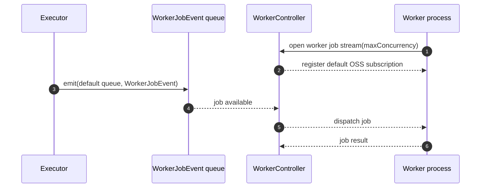
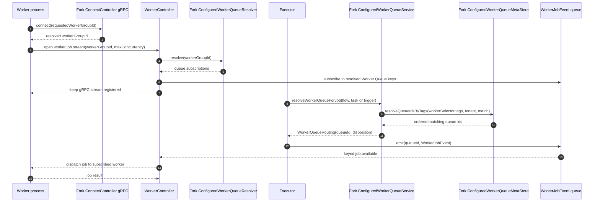

<p align="center">
  <a href="https://www.kestra.io">
    
  </a>
</p>

<h1 align="center" style="border-bottom: none">
    Open-source orchestration platform for data, AI, and infrastructure workflows
</h1>

<div align="center">
 <a href="https://github.com/kestra-io/kestra/releases"></a>
  <a href="https://github.com/kestra-io/kestra/blob/develop/LICENSE"></a>
  <a href="https://github.com/kestra-io/kestra/stargazers"></a> <br>
<a href="https://kestra.io"></a>
<a href="https://kestra.io/slack"></a>
</div>

<br />

<p align="center">
  <a href="https://x.com/kestra_io" style="margin: 0 10px;">
        </a>
  <a href="https://www.linkedin.com/company/kestra/" style="margin: 0 10px;">
        </a> 
  <a href="https://www.youtube.com/@kestra-io" style="margin: 0 10px;">
        </a>
</p>

<p align="center">
  <a href="https://trendshift.io/repositories/2714" target="_blank">
    
  </a>
  <a href="https://www.producthunt.com/posts/kestra?embed=true&utm_source=badge-top-post-badge&utm_medium=badge&utm_souce=badge-kestra" target="_blank"></a>
</p>

<p align="center">
    <a href="https://go.kestra.io/video/product-overview" target="_blank">
        
    </a>
</p>
<p align="center" style="color:grey;"><i>Click on the image to learn how to get started with Kestra in 3 minutes.</i></p>


## 🌟 What is Kestra?

Kestra is an open-source, event-driven orchestration platform for data, AI, and infrastructure workflows. It unifies **scheduled** and **event-driven** automation behind a declarative, language-agnostic interface. By bringing **Infrastructure as Code** best practices to your data, process, and microservice pipelines, you can build reliable [workflows](https://kestra.io/docs/quickstart) directly from the UI in just a few lines of YAML.

## 📖 Table of Contents

- [🚀 Quick Start](#-quick-start)
- [🧩 Plugin Ecosystem](#-plugin-ecosystem)
- [📚 Key Concepts](#-key-concepts)
- [🧭 OSS Worker Group Routing](#-oss-worker-group-routing)
- [🎨 Build Workflows Visually](#-build-workflows-visually)
- [🔧 Extensible and Developer-Friendly](#-extensible-and-developer-friendly)
- [🌐 Join the Community](#-join-the-community)
- [🤝 Contributing](#-contributing)
- [📄 License](#-license)
- [⭐️ Stay Updated](#️-stay-updated)


**Key Features:**
- **Everything as Code and from the UI:** keep **workflows as code** with a **Git Version Control** integration, even when building them from the UI.
- **Event-Driven & Scheduled Workflows:** automate both **scheduled** and **real-time** event-driven workflows via a simple `trigger` definition.
- **Declarative YAML Interface:** define workflows using a simple configuration in the **built-in code editor**.
- **Rich Plugin Ecosystem:** hundreds of plugins built in to extract data from any database, cloud storage, or API, and **run scripts in any language**.
- **Intuitive UI & Code Editor:** build and visualize workflows directly from the UI with syntax highlighting, auto-completion and real-time syntax validation.
- **Scalable:** designed to handle millions of workflows, with high availability and fault tolerance.
- **Version Control Friendly:** write your workflows from the built-in code Editor and push them to your preferred Git branch directly from Kestra, enabling best practices with CI/CD pipelines and version control systems.
- **Structure & Resilience**: tame chaos and bring resilience to your workflows with **namespaces**, **labels**, **subflows**, **retries**, **timeout**, **error handling**, **inputs**, **outputs** that generate artifacts in the UI, **variables**, **conditional branching**, **advanced scheduling**, **event triggers**, **backfills**, **dynamic tasks**, **sequential and parallel tasks**, and skip tasks or triggers when needed by setting the flag `disabled` to `true`.


🧑‍💻 The YAML definition gets automatically adjusted any time you make changes to a workflow from the UI or via an API call. Therefore, the orchestration logic is **always managed declaratively in code**, even if you modify your workflows in other ways (UI, CI/CD, Terraform, API calls).


<p align="center">
  <video src="https://github.com/user-attachments/assets/8bb47d22-848d-4281-a0ca-9790803ce1ea" autoplay loop muted playsinline width="640">
    Your browser does not support the video tag. <a href="https://go.kestra.io/video/product-overview">Watch the demo here</a>.
  </video>
</p>

---

## 🚀 Quick Start

### Launch on AWS (CloudFormation)

Deploy Kestra on AWS using our CloudFormation template:

[](https://console.aws.amazon.com/cloudformation/home#/stacks/create/review?templateURL=https://kestra-deployment-templates.s3.eu-west-3.amazonaws.com/aws/cloudformation/ec2-rds-s3/kestra-oss.yaml&stackName=kestra-oss)

### Launch on Google Cloud (Terraform deployment)

Deploy Kestra on Google Cloud Infrastructure Manager using [our Terraform module](https://github.com/kestra-io/deployment-templates/tree/main/gcp/terraform/infrastructure-manager/vm-sql-gcs).

### Get Started Locally in 5 Minutes

#### Launch Kestra in Docker

Make sure that Docker is running. Then, start Kestra in a single command:

```bash
docker run --pull=always -it -p 8080:8080 --user=root \
  --name kestra --restart=always \
  -v kestra_data:/app/storage \
  -v /var/run/docker.sock:/var/run/docker.sock \
  -v /tmp:/tmp \
  kestra/kestra:latest server local
```

If you're on Windows and use PowerShell:
```powershell
docker run --pull=always -it -p 8080:8080 --user=root `
  --name kestra --restart=always `
  -v "kestra_data:/app/storage" `
  -v "/var/run/docker.sock:/var/run/docker.sock" `
  -v "C:/Temp:/tmp" `
  kestra/kestra:latest server local
```

If you're on Windows and use Command Prompt (CMD):
```cmd
docker run --pull=always -it -p 8080:8080 --user=root ^
  --name kestra --restart=always ^
  -v "kestra_data:/app/storage" ^
  -v "/var/run/docker.sock:/var/run/docker.sock" ^
  -v "C:/Temp:/tmp" ^
  kestra/kestra:latest server local
```

If you're on Windows and use WSL (Linux-based environment in Windows):
```bash
docker run --pull=always -it -p 8080:8080 --user=root \
  --name kestra --restart=always \
  -v kestra_data:/app/storage \
  -v "/var/run/docker.sock:/var/run/docker.sock" \
  -v "/mnt/c/Temp:/tmp" \
  kestra/kestra:latest server local
```

Check our [Installation Guide](https://kestra.io/docs/installation) for other deployment options (Docker Compose, Podman, Kubernetes, AWS, GCP, Azure, and more).

Access the Kestra UI at [http://localhost:8080](http://localhost:8080) and start building your first flow!

#### Your First Hello World Flow

Create a new flow with the following content:

```yaml
id: hello_world
namespace: dev

tasks:
  - id: say_hello
    type: io.kestra.plugin.core.log.Log
    message: "Hello, World!"
```


Run the flow and see the output in the UI!

---

## 🧩 Plugin Ecosystem

Kestra's functionality is extended through a rich [ecosystem of plugins](https://kestra.io/plugins) that empower you to run tasks anywhere and code in any language, including Python, Node.js, R, Go, Shell, and more. Here's how Kestra plugins enhance your workflows:

- **Run Anywhere:**
  - **Local or Remote Execution:** Execute tasks on your local machine, remote servers via SSH, or scale out to serverless containers using [Task Runners](https://kestra.io/docs/task-runners).
  - **Docker and Kubernetes Support:** Seamlessly run Docker containers within your workflows or launch Kubernetes jobs to handle compute-intensive workloads.

- **Code in Any Language:**
  - **Scripting Support:** Write scripts in your preferred programming language. Kestra supports Python, Node.js, R, Go, Shell, and others, allowing you to integrate existing codebases and deployment patterns.
  - **Flexible Automation:** Execute shell commands, run SQL queries against various databases, and make HTTP requests to interact with APIs.

- **Event-Driven and Real-Time Processing:**
  - **Real-Time Triggers:** React to events from external systems in real-time, such as file arrivals, new messages in message buses (Kafka, Redis, Pulsar, AMQP, MQTT, NATS, AWS SQS, Google Pub/Sub, Azure Event Hubs), and more.
  - **Custom Events:** Define custom events to trigger flows based on specific conditions or external signals, enabling highly responsive workflows.

- **Cloud Integrations:**
  - **AWS, Google Cloud, Azure:** Integrate with a variety of cloud services to interact with storage solutions, messaging systems, compute resources, and more.
  - **Big Data Processing:** Run big data processing tasks using tools like Apache Spark or interact with analytics platforms like Google BigQuery.

- **Monitoring and Notifications:**
  - **Stay Informed:** Send messages to Slack channels, email notifications, or trigger alerts in PagerDuty to keep your team updated on workflow statuses.

Kestra's plugin ecosystem is continually expanding, allowing you to tailor the platform to your specific needs. Whether you're orchestrating complex data pipelines, automating scripts across multiple environments, or integrating with cloud services, there's likely a plugin to assist. And if not, you can always [build your own plugins](https://kestra.io/docs/plugin-developer-guide/) to extend Kestra's capabilities.

🧑‍💻 **Note:** This is just a glimpse of what Kestra plugins can do. Explore the full list on our [Plugins Page](https://kestra.io/plugins).

---

## 📚 Key Concepts

- **Flows:** the core unit in Kestra, representing a workflow composed of tasks.
- **Tasks:** individual units of work, such as running a script, moving data, or calling an API.
- **Namespaces:** logical grouping of flows for organization and isolation.
- **Triggers:** schedule or events that initiate the execution of flows.
- **Inputs & Variables:** parameters and dynamic data passed into flows and tasks.

---

## 🧭 OSS Worker Group Routing

This fork includes static, configuration-backed worker group routing for OSS deployments. It keeps the upstream OSS worker dispatch path as the default, then adds a routing step only when operators define worker groups and worker queues in `kestra.worker.routing` and a job declares `workerSelector.tags`.

Upstream OSS sequence, unchanged when routing is not configured:



Fork-added routing sequence, used only for configured `workerSelector.tags`:



The worker process does not subscribe to the backend `WorkerJobEvent` queue
directly, and it is not sent the list of Worker Queue ids it serves. It only
declares a `workerGroupId` when connecting. The controller resolves that group
with `ConfiguredWorkerQueueResolver`, creates controller-side subscriptions to
the corresponding Worker Queue keys, and forwards matching jobs to eligible
workers over the long-lived gRPC worker job stream. The worker then buffers the
received jobs in its local in-process queue before executing them.

The long-lived gRPC worker job stream infrastructure is not introduced by this
fork. `GrpcWorkerControllerService`, `WorkerStreamContext`, `WorkerJobDispatcher`,
and the default `WorkerQueueResolver` already provide the worker stream,
`workerGroupId`, queue subscription, and response observer plumbing. This fork
adds `ConfiguredWorkerQueueResolver` to resolve `workerGroupId` from static OSS
configuration, and tightens `WorkerJobDispatcher` registration bookkeeping so
worker-group and Worker Queue indices remain consistent when workers reconnect.

Once `ConfiguredWorkerQueueService` returns a `WorkerQueueRouting`, the executor
normalizes that Worker Queue id into the keyed `WorkerJobEvent` dispatch key and
emits the job to the existing worker job queue. `WorkerJobDispatcher` receives
the event through its controller-side `QueueSubscriber`, finds a registered
worker stream for that Worker Queue with available permits and capacity,
persists the running state, wraps the job in a `WorkerJobResponse`, and calls
the stream's `StreamObserver.onNext(...)`. If no subscribed worker has capacity,
the dispatcher pauses that Worker Queue subscription and requeues the event so
backpressure stays on the controller side.

Worker Queue matching is not a broadcast mechanism. If a `workerSelector.tags`
set matches multiple Worker Queue definitions, the resolver orders the matching
queues and selects exactly one Worker Queue id for that `WorkerJob`. The executor
emits the job once, using that single queue key. This avoids running the same
`TaskRun` on multiple workers and keeps task results, retries, kill handling,
and external side effects single-dispatch.

### Worker groups, Worker Queues, and worker configuration

In this fork, Worker Groups and Worker Queues are separate concepts:

- `workerGroupId` identifies which Worker Group a worker process belongs to.
- `groupQueueMappings` maps each Worker Group to the Worker Queues it subscribes
  to.
- `queues` defines each Worker Queue and the tags used to select it from
  `workerSelector.tags`.

A Worker Group is therefore not itself the dispatch queue. It is the worker-side
subscription group. A Worker Queue is the actual dispatch key used when the
executor emits a `WorkerJobEvent`.

The routing relationship is:

```text
worker process
  -> workerGroupId
  -> groupQueueMappings[workerGroupId].queues
  -> subscribed Worker Queue ids

task / trigger / flow
  -> workerSelector.tags
  -> queues.*.tags
  -> matching Worker Queue id
  -> workers subscribed to that queue
```

Each worker process only needs to declare its own Worker Group id:

```yaml
kestra:
  worker:
    routing:
      workerGroupId: gce-gpu
```

The worker group is chosen from that configuration value. It is not inferred from
host names, CPU or GPU devices, Kubernetes node labels, or any other runtime
property. If `workerGroupId` is absent or empty, it is normalized to the default
worker group.

Controller-side services need the full routing table:

```yaml
kestra:
  worker:
    routing:
      groupQueueMappings:
        gce-gpu:
          queues:
            - workerQueueId: gpu-jobs
              reservedPercent: -1
        gce-cpu:
          queues:
            - workerQueueId: cpu-jobs
              reservedPercent: -1
      queues:
        gpu-jobs:
          tags: [gce, gpu]
        cpu-jobs:
          tags: [gce, cpu]
```

This configuration means:

```text
gce-gpu workers subscribe to gpu-jobs
gce-cpu workers subscribe to cpu-jobs
gpu-jobs is selected by workerSelector tags matching [gce, gpu]
cpu-jobs is selected by workerSelector tags matching [gce, cpu]
```

A task, trigger, or flow selects a Worker Queue by tags, not by Worker Group name:

```yaml
workerSelector:
  tags: [gpu]
  match: ALL
  fallback: WAIT
```

With the configuration above, `[gpu]` matches the `gpu-jobs` Worker Queue, and
jobs emitted to `gpu-jobs` are dispatched only to workers in groups subscribed to
that queue, such as `gce-gpu`.

Worker Groups and Worker Queues do not need to be one-to-one. For example, a
local deployment can run one Worker Group that subscribes to every routed queue:

```yaml
kestra:
  worker:
    routing:
      workerGroupId: local-all
      groupQueueMappings:
        local-all:
          queues:
            - workerQueueId: gpu-jobs
              reservedPercent: -1
            - workerQueueId: cpu-jobs
              reservedPercent: -1
      queues:
        gpu-jobs:
          tags: [gce, gpu]
        cpu-jobs:
          tags: [gce, cpu]
```

For compact deployments, the explicit `groupQueueMappings` block is optional
when the `workerGroupId` has the same name as a configured Worker Queue. In that
case, the controller subscribes the worker to the same-named queue.

Every `workerQueueId` referenced from `groupQueueMappings.*.queues` must either
be a configured entry under `queues` or one of the reserved queues (`default` or
`system`). Kestra fails configuration loading when a mapping points at an
undefined Worker Queue.

Invalid example:

```yaml
kestra:
  worker:
    routing:
      groupQueueMappings:
        gce-gpu:
          queues:
            - workerQueueId: not-exists-queue
      queues:
        gpu-jobs:
          tags: [gpu]
```

This is rejected because `not-exists-queue` is subscribed by a Worker Group but
is not defined under `queues`.

Database impact in this fork:

- No new database tables, columns, indexes, or migration scripts are required for OSS worker group routing.
- Worker group and worker queue metadata is static and configuration-backed through `kestra.worker.routing`, not repository-backed.
- Routed jobs keep using the existing `WorkerJobEvent` queue storage; the fork only changes the queue key chosen before dispatch.

If routing is not configured, or a job has no `workerSelector.tags`, Kestra keeps the default OSS worker queue behavior. If a matching queue has no connected worker, the selector `fallback` decides whether to wait, fail, cancel, or ignore the route. See [OSS Worker Routing](docs/architecture/OSS_WORKER_ROUTING.md) for configuration examples and operational checks.

---

## 🎨 Build Workflows Visually

Kestra provides an intuitive UI that allows you to interactively build and visualize your workflows:

- **Drag-and-Drop Interface:** add and rearrange tasks from the Topology Editor.
- **Real-Time Validation:** instant feedback on your workflow's syntax and structure to catch errors early.
- **Auto-Completion:** smart suggestions as you type to write flow code quickly and without syntax errors.
- **Live Topology View:** see your workflow as a Directed Acyclic Graph (DAG) that updates in real-time.

---


## 🔧 Extensible and Developer-Friendly

### Plugin Development

Create custom plugins to extend Kestra's capabilities. Check out our [Plugin Developer Guide](https://kestra.io/docs/plugin-developer-guide/) to get started.

### Infrastructure as Code

- **Version Control:** store your flows in Git repositories.
- **CI/CD Integration:** automate deployment of flows using CI/CD pipelines.
- **Terraform Provider:** manage Kestra resources with the [official Terraform provider](https://kestra.io/docs/terraform/).

---

## 🌐 Join the Community

Stay connected and get support:

- **Slack:** Join our [Slack community](https://kestra.io/slack) to ask questions and share ideas.
- **LinkedIn:** Follow us on [LinkedIn](https://www.linkedin.com/company/kestra/) — next to Slack and GitHub, this is our main channel to share updates and product announcements.
- **YouTube:** Subscribe to our [YouTube channel](https://www.youtube.com/@kestra-io) for educational video content. We publish new videos every week!
- **X:** Follow us on [X](https://x.com/kestra_io) if you're still active there.

---

## 🤝 Contributing

We welcome contributions of all kinds!

- **Report Issues:** Found a bug or have a feature request? Open an [issue on GitHub](https://github.com/kestra-io/kestra/issues).
- **Contribute Code:** Check out our [Contributor Guide](https://kestra.io/docs/contribute-to-kestra) for initial guidelines, and explore our [good first issues](https://go.kestra.io/contributing) for beginner-friendly tasks to tackle first.
- **Develop Plugins:** Build and share plugins using our [Plugin Developer Guide](https://kestra.io/docs/plugin-developer-guide/).
- **Contribute to our Docs:** Contribute edits or updates to keep our [documentation](https://github.com/kestra-io/docs) top-notch.

---

## 📄 License

Kestra is licensed under the Apache 2.0 License © [Kestra Technologies](https://kestra.io).

---

## ⭐️ Stay Updated

Give our repository a star to stay informed about the latest features and updates!

[](https://github.com/kestra-io/kestra)

---

Thank you for considering Kestra for your workflow orchestration needs. We can't wait to see what you'll build!
