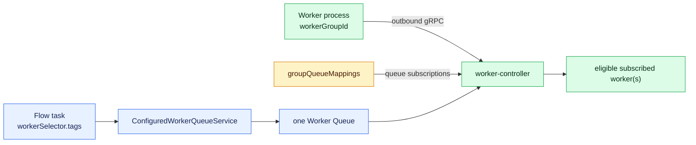
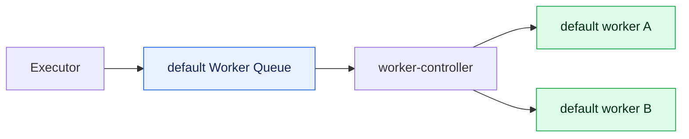
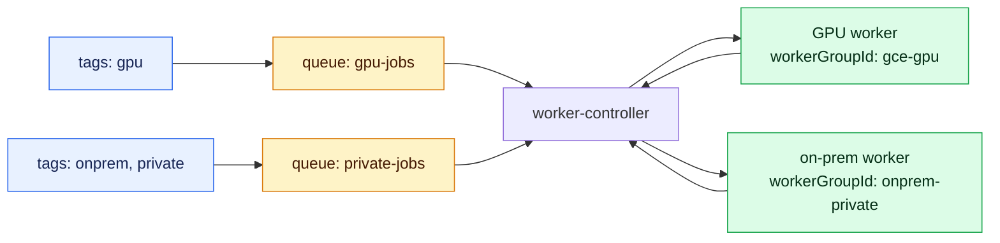
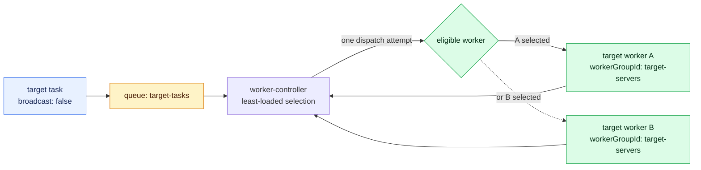
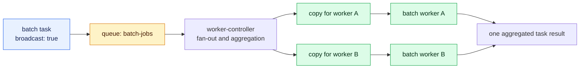
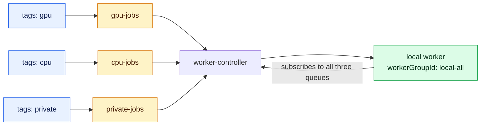
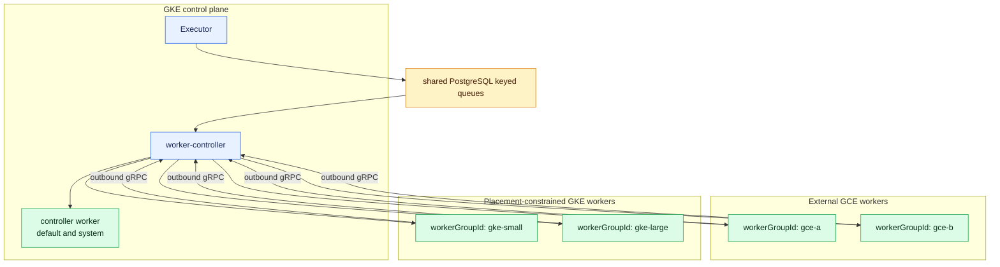

# OSS Worker Routing Deployment Patterns

This document describes how the static OSS worker routing added by this fork
maps tasks to different Kestra worker topologies. It includes the redundant
worker pattern in which each dispatch attempt runs on only one worker.

For the complete routing architecture, configuration model, tag matching, and
broadcast behavior, see [OSS Worker Routing](OSS_WORKER_ROUTING.md).

## Routing Model

The four names used by the feature have different roles:

- `workerGroupId` is the identity advertised by a worker process;
- a Worker Group maps that identity to one or more queue subscriptions;
- a Worker Queue is the controller-side dispatch key; and
- `workerSelector.tags` is the task request resolved to one Worker Queue.



Workers do not poll the backend Worker Job queue directly. They open an
outbound gRPC stream, advertise their group and capacity, and receive jobs from
the worker-controller over that stream.

## Deployment Patterns

### 1. Default OSS dispatch without static routing

When `kestra.worker.routing.queues` is absent or empty, or a job has no
`workerSelector.tags`, the fork preserves the upstream OSS default queue path.



The controller chooses one eligible default worker for each normal dispatch.
This configuration is appropriate when tasks do not require placement by
machine capability or network location.

### 2. Dedicated Worker Group per machine class

Use separate Worker Groups and queues when tasks require different machine
capabilities, placement domains, or private-network access.



Routing happens before dispatch. A GPU task is not sent to the private worker
and then skipped; only workers subscribed to `gpu-jobs` are eligible.

### 3. Redundant workers with single-worker dispatch

Use one Worker Group for two or more equivalent servers and set
`workerSelector.broadcast: false` on the task. Each dispatch attempt goes to
one eligible worker in the pool.



This is controller-side load balancing, not a race in which the fastest worker
fetches the event. See [Complete Redundant Single-Dispatch Configuration](#complete-redundant-single-dispatch-configuration)
for the full YAML and failure semantics.

### 4. Broadcast to every worker in a group

For a runnable task with a task-level selector, broadcast is enabled by default.
The controller snapshots the workers subscribed to the matched queue and creates
one pinned copy per worker.



Use this topology for work that intentionally must run on every current group
member. Broadcast aggregation requires one worker-controller instance; see the
main architecture document for lifecycle and result-aggregation limitations.

### 5. One local Worker Group serving multiple queues

Local or staging environments can keep production flow selectors unchanged
while one worker process subscribes to every required queue.



Only deployment configuration changes between environments. The same flow YAML
can use the same tags in local, staging, and production.

## Complete Redundant Single-Dispatch Configuration

### Intended Use Case

Use this pattern when:

- a task must run on a specific class of server;
- two or more equivalent worker servers provide capacity or redundancy; and
- each task dispatch must be handled by only one available worker in that pool.

For example, two on-premises servers can advertise the same Worker Group. Both
subscribe to the same Worker Queue, but the worker-controller sends each task
dispatch to only one of them.

```text
task workerSelector.tags
  -> one matching Worker Queue
  -> worker-controller
  -> one eligible worker from the subscribed pool
```

Workers do not race to fetch the job from the backend queue. The controller
consumes the queued event and sends it over the selected worker's existing gRPC
stream.

### Routing table

Services that resolve or dispatch routed jobs need the full routing table:

```yaml
kestra:
  worker:
    routing:
      groupQueueMappings:
        target-servers:
          queues:
            - workerQueueId: target-tasks
              reservedPercent: -1
      queues:
        target-tasks:
          tags:
            - target-server
```

This configuration separates the two routing concepts:

- `target-servers` is the Worker Group advertised by worker processes;
- `target-tasks` is the Worker Queue used as the dispatch key; and
- `target-server` is the tag requested by a flow task.

### Worker servers

Configure both equivalent worker servers with the same group id:

```yaml
kestra:
  worker:
    routing:
      workerGroupId: target-servers
```

The controller resolves that group id to the `target-tasks` subscription. A
worker does not select its own tasks by inspecting `workerSelector.tags`.

### Flow task

Set the selector on the task and explicitly disable broadcast dispatch:

```yaml
id: single_target_worker
namespace: company.operations

tasks:
  - id: run_on_one_target_server
    type: io.kestra.plugin.scripts.shell.Commands
    workerSelector:
      tags:
        - target-server
      match: ALL
      fallback: WAIT
      broadcast: false
    commands:
      - ./run-job.sh
```

`broadcast: false` is required for this use case. In this fork, a runnable task
with a task-level selector uses broadcast dispatch by default. Omitting this
property would run the task on every worker currently subscribed to the matched
Worker Queue.

`fallback: WAIT` prevents the task from being sent to the default Worker Queue
when the target pool is unavailable. Once the configured queue is selected, the
job remains queued until a subscribed worker has capacity or connects.

## Worker Selection

For non-broadcast dispatch, the worker-controller considers only workers that:

- are currently registered for the selected Worker Queue;
- advertise at least one available permit; and
- have capacity in the queue's reservation bucket.

Eligible workers are ordered by their current number of in-flight jobs. The
least-loaded worker is tried first. If it loses a concurrent permit reservation
or has no remaining bucket capacity, the controller tries the next candidate.

Selection is therefore controller-side load balancing, not a fastest-fetch
race. When candidates have the same in-flight count, the selected worker is not
defined by this feature and must not be relied upon for affinity or ordering.

For two equivalent workers, the observable behavior is:

| Worker A | Worker B | Result |
| --- | --- | --- |
| available, less loaded | available, more loaded | Worker A is preferred |
| available, equal load | available, equal load | Either worker may be selected |
| unavailable or full | available | Worker B is selected |
| unavailable or full | unavailable or full | The queue waits for capacity |

## Delivery And Failure Semantics

Single-worker dispatch means one worker receives each dispatch attempt. It does
not provide application-level exactly-once execution across crashes and
redelivery.

Before sending a job, the controller persists its running state. If persistence
or delivery fails, it releases the reserved capacity and requeues the job. A
later attempt may therefore be sent to the other worker. Tasks that produce
external side effects should be idempotent or use their own deduplication key.

If no subscribed worker has capacity, the controller pauses the Worker Queue
subscription and requeues the event. A later permit update or worker connection
resumes dispatch.

## Kestra Playground Examples

The companion
[`tacogips/kestra-playground`](https://github.com/tacogips/kestra-playground)
repository contains runnable configurations, flows, and verification scripts
for the routing patterns described here:

- [GCP routed worker flow](https://github.com/tacogips/kestra-playground/blob/main/kestra/flows-worker-routing/verify_gcp_worker_routing.yaml)
  routes separate tasks to the `gce-a` and `gce-b` Worker Queues;
- [GKE node worker routing flow](https://github.com/tacogips/kestra-playground/blob/main/kestra/flows-worker-routing/verify_gke_node_worker_routing.yaml)
  demonstrates `gke-small` and `gke-large` routed worker classes;
- [batch group broadcast flow](https://github.com/tacogips/kestra-playground/blob/main/kestra/flows-worker-routing/verify_batch_group_broadcast.yaml)
  explicitly broadcasts one task to every worker in the selected group;
- [local broadcast configuration](https://github.com/tacogips/kestra-playground/blob/main/local/broadcast/application.yaml)
  maps two local workers in one group to the same queue; and
- [local broadcast verification](https://github.com/tacogips/kestra-playground/blob/main/scripts/verify-local-batch-group-broadcast.sh)
  starts a controller and two workers, executes the flow, and verifies both
  worker-keyed outputs.

The Playground routing table also shows a mixed deployment in which the
controller serves `default` and `system`, GCE workers serve `gce-a` and `gce-b`,
and Kubernetes workers serve `gke-small` and `gke-large`:



These examples use the same static routing primitives as this document. The
single-worker pool variant is obtained by assigning equivalent workers the same
`workerGroupId` and setting `broadcast: false` on the selected task.

## Operational Checks

Verify both workers are connected to the intended queue with the queue-scoped
metrics:

```text
controller.worker.active{worker_queue="target-tasks"}
controller.permits.available{worker_queue="target-tasks"}
controller.job.inflight{worker_queue="target-tasks"}
```

For the two-server example, `controller.worker.active` should normally report
`2`. Queue lag together with an active-worker value of `0` indicates that jobs
are waiting for a matching worker to connect.

## Limitations

- Worker identity is configured through `workerGroupId`; it is not inferred
  from hostnames, machine labels, CPU architecture, or accelerator hardware.
- `workerSelector.tags` selects a Worker Queue, not a specific worker instance.
- Equal-load selection does not provide sticky sessions or deterministic host
  affinity.
- Use distinct Worker Queues or groups when tasks require different machine
  capabilities. Do not depend on a worker checking and skipping an unsuitable
  job after dispatch.
